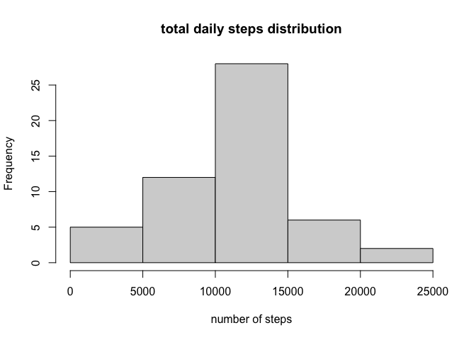
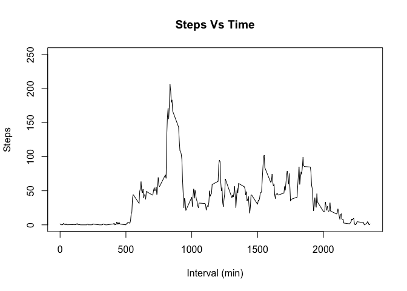
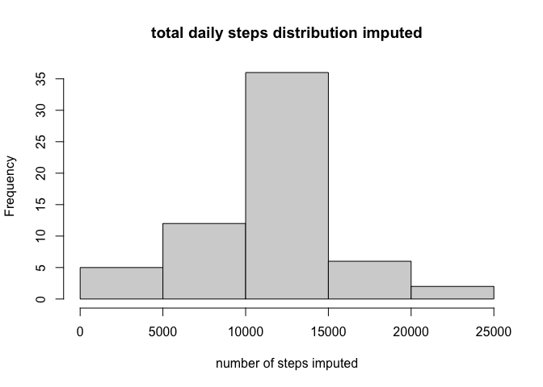
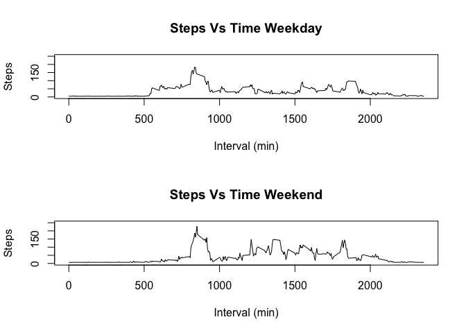

## Loading and preprocessing the data

```r
library(dplyr)
library(lubridate)
#Loading in the proper data
url <- 'https://d396qusza40orc.cloudfront.net/repdata%2Fdata%2Factivity.zip'
download.file(url, 'activity.zip', method = 'curl')
unzip('activity.zip')
activity <- read.csv('activity.csv')
#removing NA's from data
activityNAomit <- activity[!is.na(activity$steps), ]
```
## What is mean total number of steps taken per day?
Histogram showing the distribution of steps per day 

<!-- -->


5 number summary of steps per day

```
##    Min. 1st Qu.  Median    Mean 3rd Qu.    Max. 
##      41    8841   10765   10766   13294   21194
```
## What is the average daily activity pattern?
<!-- -->


Finding the time of day when maximum steps usually occurs

**Time with the max steps is at 835 minutes **


## Imputing missing values
How many missing values exist for steps?:

**There are 2304 missing values for steps in our data out of 17568 values, this means that 13.11% of values were missing**

When we impute the average activity level for all missing values instead of just ignoring them, we can see that this centralizes the distribution more

<!-- -->


The new 5 number summary after imputing the steps data

```
##    Min. 1st Qu.  Median    Mean 3rd Qu.    Max. 
##      41    9819   10766   10766   12811   21194
```
## Are there differences in activity patterns between weekdays and weekends?
The weekends appear to have more activity in the middle of the day than the weekdays
<!-- -->

